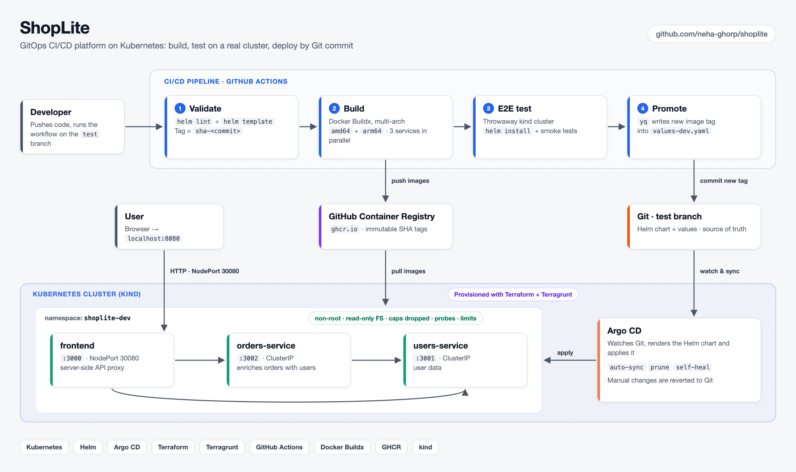

# ShopLite: GitOps Delivery on Kubernetes

An end-to-end DevOps project: three Node.js microservices, provisioned with **Terraform/Terragrunt**,
packaged with **Helm**, built and tested by **GitHub Actions**, and continuously deployed by **ArgoCD**
to a Kubernetes (kind) cluster.

The application itself is deliberately small. The focus is the platform around it: infrastructure as code,
a CI pipeline that tests on a real cluster before it ships, and Git as the only way to change what runs.


## What this project demonstrates

- **Infrastructure as code**: Terraform modules for the cluster and ArgoCD, wired per environment with Terragrunt (DRY config, separate state per component).
- **GitOps**: ArgoCD with automated sync, `prune` and `selfHeal`. The cluster always matches Git, and manual `kubectl` changes get reverted.
- **CI/CD with a real test gate**: every build is deployed to a throwaway kind cluster inside the pipeline and smoke-tested end to end before the new tag is promoted.
- **Multi-arch images**: Docker Buildx + QEMU build `linux/amd64` and `linux/arm64`, so the same tag runs on cloud runners and Apple Silicon.
- **Immutable, traceable releases**: images are tagged `sha-<commit>`, and the deployed version is a commit in Git, so a rollback is a `git revert`.
- **Secure-by-default pods**: non-root user, read-only root filesystem, all Linux capabilities dropped, no privilege escalation, resource requests/limits, liveness and readiness probes.
- **One Helm chart for many services**: a single templated chart renders a Deployment and Service per service, with per-environment overrides.

## Architecture



**Request flow:** `frontend` → `orders-service` → `users-service`. The frontend proxies API calls server-side,
so internal services are never exposed outside the cluster. Services find each other through Kubernetes DNS
(`http://users-service:3001`).

## CI/CD pipeline

[`.github/workflows/ci-cd.yaml`](.github/workflows/ci-cd.yaml)

| Stage | What it does |
|---|---|
| **validate** | `helm lint` and `helm template` the chart, and compute the image tag `sha-<commit>` |
| **build** | Matrix build of the 3 services with Buildx (amd64 + arm64), pushed to ghcr.io with layer caching |
| **e2e** | Creates a kind cluster on the runner, installs the chart with the new tag, and runs [`scripts/e2e-test.sh`](scripts/e2e-test.sh). On failure it dumps pod status, events and logs. |
| **promote** | Writes the new tag into `helm/shoplite/values-dev.yaml` with `yq` and commits it to `test`. ArgoCD then rolls it out. |

The pipeline never runs `kubectl` against the dev cluster. Deployment is only ever a Git commit, and ArgoCD pulls it in.

## Repository layout

```
apps/                      3 Node.js services, each with a Dockerfile
docker-compose.yml         run everything locally without Kubernetes
helm/shoplite/             one chart for all services (values.yaml + values-dev.yaml)
terraform/modules/         reusable modules: kind-cluster, argocd
terragrunt/dev/            dev environment wiring the modules (root.hcl holds shared config)
argocd/shoplite-dev.yaml   ArgoCD Application: tracks helm/shoplite on the test branch
.github/workflows/         CI/CD pipeline
scripts/e2e-test.sh        end-to-end smoke test (used in CI and locally)
docs/                      architecture diagram (PNG + editable HTML source)
```

## Design decisions

- **ArgoCD tracks `test`, not `main`.** `main` is branch-protected, so the pipeline can't push tag bumps to it. `test` acts as the dev environment branch, and promotion to other environments would happen by PR.
- **Helm rendered by ArgoCD, not `helm install`.** Git is the source of truth. There is no Helm release state in the cluster to drift from it, and rollback means reverting a commit.
- **e2e on an ephemeral cluster.** A broken image or chart fails in CI and never reaches the dev environment.
- **Terragrunt over plain Terraform.** It keeps the state backend config in one place (`root.hcl`) and gives each component its own state, so adding a `staging/` environment is a copy of `dev/` with different inputs.
- **Numeric `runAsUser`.** The images run as the non-root `node` user. Kubernetes can only enforce `runAsNonRoot` with a numeric UID, so the chart sets `runAsUser: 1000`.

## Run it yourself

### Prerequisites

`docker`, `kubectl`, `terraform`, `terragrunt`, `helm`, `kind`:

```sh
brew install terraform terragrunt helm kind kubectl
```

### 1. Create the cluster and install ArgoCD

```sh
cd terragrunt/dev
terragrunt run --all apply      # older terragrunt: terragrunt run-all apply
kubectl config use-context kind-shoplite-dev
```

ArgoCD UI: http://localhost:8081 (user `admin`). Get the password with:

```sh
kubectl -n argocd get secret argocd-initial-admin-secret -o jsonpath='{.data.password}' | base64 -d
```

### 2. Hand the app to ArgoCD

```sh
kubectl apply -f argocd/shoplite-dev.yaml
kubectl -n argocd get application shoplite-dev -w     # wait for Synced / Healthy
```

App: http://localhost:8080

### 3. Run the end-to-end test

```sh
scripts/e2e-test.sh http://localhost:8080
```

### Ship a change

GitHub → Actions → **CI/CD** → Run workflow → branch `test`. The pipeline builds, tests and commits the new tag,
and ArgoCD rolls it out.

> Forking this repo? ghcr.io packages start out private. After the first pipeline run, make the 3 packages public
> (Profile → Packages → package → Package settings → Change visibility) so the cluster can pull them.

### Without ArgoCD

```sh
docker compose up --build                                   # plain Docker
helm install shoplite helm/shoplite -f helm/shoplite/values-dev.yaml -n shoplite-dev --create-namespace
```

### Tear down

```sh
kubectl delete -f argocd/shoplite-dev.yaml
cd terragrunt/dev && terragrunt run --all destroy
```

## Troubleshooting practice

This cluster is also used to practice breaking and fixing things the GitOps way. For example, a bad
`NODE_OPTIONS` value was committed to cause a CrashLoopBackOff, debugged with `describe` and `logs --previous`
(exit code 1, `Cannot find module`), and fixed in Git, because with ArgoCD `selfHeal` a direct `kubectl` fix
would be reverted. The rolling update kept the old pod serving, so the bad deploy caused no downtime.
See the `lab:` and `fix(dev):` commits in the history.

## Roadmap

- [ ] Ingress controller instead of NodePort
- [ ] Prometheus + Grafana monitoring
- [ ] External Secrets Operator for secret management
- [ ] Staging environment with PR-based promotion
- [ ] HPA and PodDisruptionBudgets
- [ ] Deploy to EKS using the same Terragrunt layout
